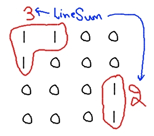
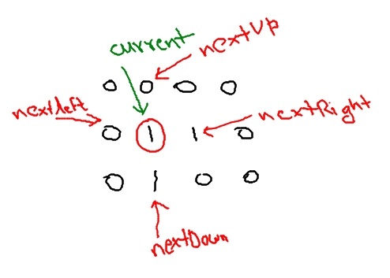

# Classic-Cookie-Challenge Solved

Here is the Python code to solve ***Classic Cookie Challenge - By Hitesh Choudhary***

[***Youtube Challenge Link***](https://www.youtube.com/watch?v=a4Py6rrf2Dk)

#### Input
1 1 0 0

1 0 0 0

0 0 0 1

0 0 0 1

1 - Cookie Chip,
0 - Cookie Base

#### Output
[3,2]

#### Explanation of output

## Algorithm

> - lineSum - store sum of cookie chip length
> - currentPos - store current position of cookie chip
> - lines - store length of each line sum which is output
_____________________________________________
> 1. Find the first cookie point in 2D Array and set position to **currentPos**
> 2. Set **currentPos** position value with 0 and **lineSum** +1 
> 3. while nextLeft and nextRight and nextUp and nextDown != 0 repeat steps

>> 3 a. increment **lineSum** if **nextleft** or **nextright** or **nextup** or **nextdown** == 1

>> 3 b. set current position value in array to 0

>> 3 c. set current = next[left, right, up ,down] (In recursion form)
> 4. append **lineSum** in **lines**
> 5. if 2D Array all element == 0 then
>> 5 a. exit

>> 5 b. **else** repete from step 1
